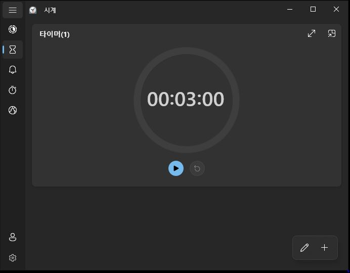
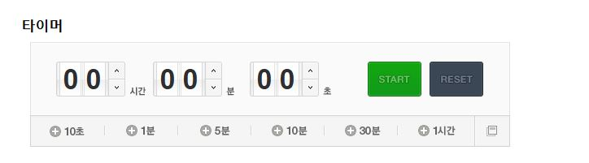
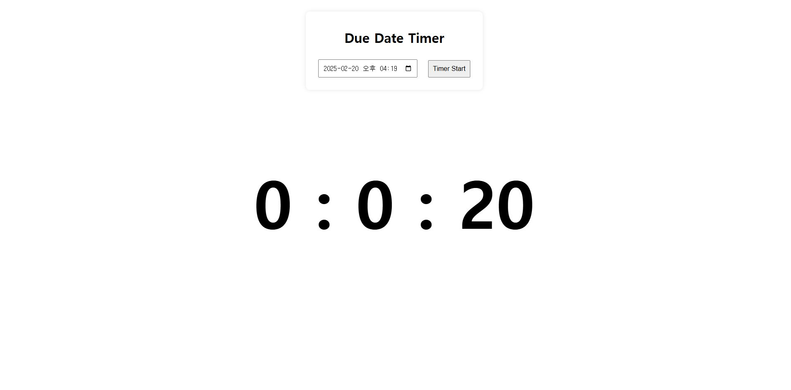

# DueDateTimer
시간을 기준으로 사용하는 기존의 타이머와 달리, 마감일자를 입력하면 현재시간에서 자동으로 남은 시간을 계산하여 출력해주는 웹 페이지입니다. 

### 📌 프로젝트 설명
- 3분, 5분과 같이 카운트 다운을 진행할 시간을 정확히 알고 있어야 했던 기존의 타이머와 달리, 
마감 일자나 시간을 기준으로 자동으로 남은 시간을 계산해서 타이머 형태로 보여주는 Due Date Timer
- 타이머 종료 시에, alert 알람 소리와 함께 배경색이 전환되는 동작이 됩니다.
- [작동 영상](https://www.youtube.com/watch?v=ApEcESYl3Mc)

### ✔ 기존 타이머와의 비교

#### 기존 타이머 1 (windows 기본 타이머)

---
#### 기존 타이머 2 (네이버 타이머)

---
#### DueDateTimer

